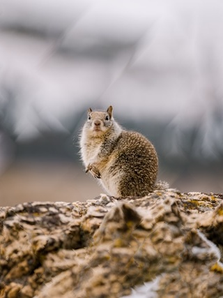
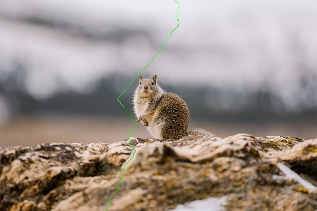

# SeamCarving in C++

An implementation of the Seam Carving algorithm using C++ and OpenCV.

Seam Carving is an image resizing algorithm that preserves the scale of objects in images. This was first proposed by Avidan and Shamir[1].
The algorithm finds vertical seams (vertical paths) in an image that are unimportant.
Seams are found by using edge detection and finding a vertical path that minimises the interestion of edges.

This project was inspired by this video: https://www.youtube.com/watch?v=rpB6zQNsbQU

## Examples
| Original | 50% scaled (Seam Carving) | 50% scaled (Bicubic)
| ------------- | ------------- | ------------- |
|   |   | 
|   |   | 

Example of a seam in an image to be removed:\

## References
[1] Avidan, Shai, and Ariel Shamir. 2007. “Seam Carving for Content-Aware Image Resizing.” In ACM Transactions on Graphics (TOG), 26:10.
